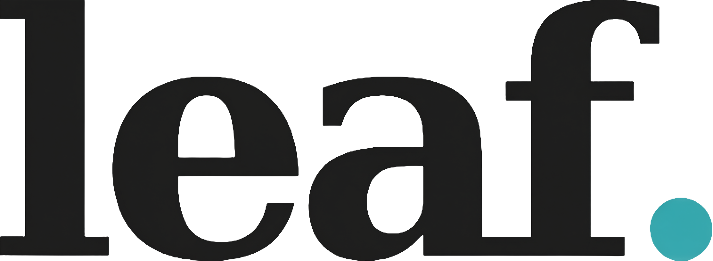

*「一叶落地，一念生根。」*

在这个人人都在建平台的时代，Leaf. 选择做一款工具。

无 AI。无打扰。零付费。开源。

它不想锁住你，只想接住那些你还没来得及写下的念头。

Web 优先，云端同步，老设备友好。纯文本与 Markdown 为骨，不绑架你的数据，也不强迫你学习复杂的结构。

---

**为什么会有 Leaf.**

市面上的笔记工具很多，但每一款都有它自己的方向：

- flomo 让你无压力输入，但它的 AI 方向和 Markdown 缺失让你犹豫。

- 幕布历经两次卖身，依然保持独立运营，但大纲笔记不是所有人的需求。

- 熊掌记是 Markdown 笔记里的一汪清流，但它锁在苹果生态里。

Leaf.不是来替代它们的。它是你在用完它们之后，仍想坐下来写点东西时，顺手打开的那个地方。

---

**Leaf.不是什么**

- 不是 AI 笔记工具

- 不是 All-in-One 平台

- 不是付费订阅产品

- 不是苹果生态专属

它只是一片叶子，落下来，接住你落下来的念头。

---

**设计原则**
| 原则 | 说明 |
|:---|:---|
| **无 AI** | 不替你思考，不替你总结，不替你写。只存储你写下来的。 |
| **零付费** | 功能全开放，不设付费墙。你不需要为“导出”或“同步”付钱。 |
| **开源** | 你可以 fork，可以修改，可以把它变成你自己的版本。 |
| **Web + 云端优先** | 老设备也能打开，不挑生态，不占存储。 |
| **Less is more** | 不做平台，只做工具。即用即走。 |
---

**技术选型**

- 纯文本 + Markdown：你写什么，它就存什么。不额外加层。

- 云端同步：登录即可访问，不依赖单台设备。

- 轻量：不安装，不更新，不后台运行。

---

**路线图**

☐ Markdown 解析引擎完善

☐ 本地数据导出功能

☐ 移动端适配优化

☐ 独立域名配置

---

**许可证**

本项目基于 Apache License 2.0 开源。

𝓫𝔂 𝓶.𝔁. 🌕

---

*"A falling leaf, a growing thought."*

In an era when everyone builds platforms, Leaf. chooses to be a tool.

No AI. No interruptions. No paywalls. Open source.

It doesn’t try to keep you — it only tries to catch what you’re about to lose.

Web-first, cloud-sync, old-device friendly. Plain text and Markdown at its core. No vendor lock-in, no forced structure.

---

**Why Leaf.**

There are plenty of note-taking tools out there, but each one has its own direction:

- flomo lets you write without pressure, but its AI direction and lack of Markdown support leave you hesitant.

- Mubu has survived two acquisitions and still runs independently, but outlines aren’t for everyone.

- Bear is a stream of clean water in the Markdown world, but it’s locked inside the Apple ecosystem.

Leaf. isn’t here to replace them. It’s the place you open when you’ve used them all and still want to sit down and write.

---

**What Leaf. is not**

- Not an AI note-taking tool

- Not an All-in-One platform

- Not a paid subscription product

- Not Apple-exclusive

---

**Design Principles**
| **Principle** | **What it means** |
|:---|:---|
| **No AI** | It doesn’t think for you, summarize for you, or write for you. It only stores what you write. |
| **No paywall** | All features are open. You don’t pay for export, sync, or anything else. |
| **Open source** | Fork it. Modify it. Make it your own version. |
| **Web + cloud-first** | Old devices can open it. It doesn’t lock you into any ecosystem or take up your storage. |
| **Less is more** | Not a platform. Just a tool. Use it and leave it. |

---

**Tech Choices**

- Plain text + Markdown : What you write is what it stores. No extra layers.

- Cloud sync : Log in and access your notes from anywhere. No dependency on a single device.

- Lightweight : No installation, no updates, no background processes.

---

**Roadmap**

☐ Improve Markdown parsing engine

☐ Add local data export

☐ Optimize mobile adaptation

☐ Configure custom domain

---

**License**

This project is open-sourced under the Apache License 2.0.

𝓫𝔂 𝓶.𝔁. 🌕
